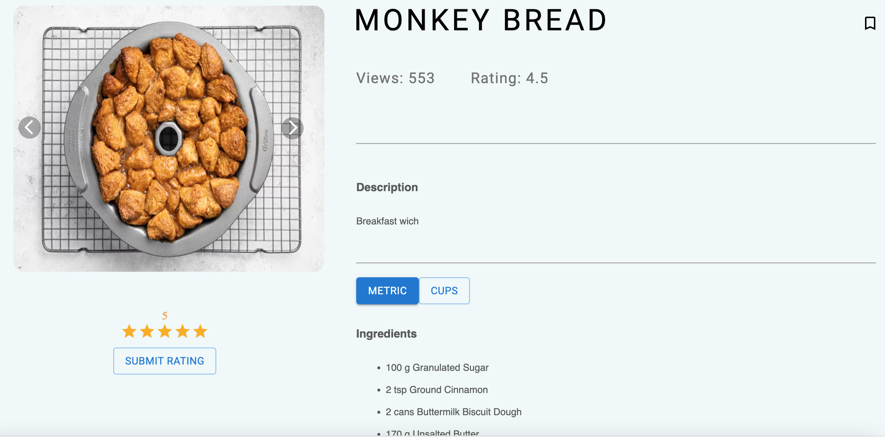

# Short & Savory

## Technologies & Tools used
  - MongoDB, Mongoose
  - Express
  - React Typescript
  - Node
  - Material UI
  - Github

## Timeframe
  - 1 week

## Description
This project represents my take on a food recipe website and my cooking hobby. This application was my capstone project while I was attending the Software Engineering Immersive course at General Assembly. It sums up the skills and experiences that I have accumulated so far.

As food recipe consumers, some users might find it exasperating to filter through a slew of descriptive texts and stories just to access the ingredients and instructions section. Such problems would be especially cumbersome for those with limited time, thus exacerbating the redundancy of said stories.

Utilising my current tech skills, the purpose of this capstone was to consolidate my 3-month learning journey, and fulfill my desire to create a food recipe website that meets my expectations and hopefully aid my fellow food lovers.

## Deployment
The application can be found at: https://project-4-sv14.onrender.com

## User Stories
| As a Guest, when I...                    |  I want to be able to...                
| :--------------------------------------- |:-----------------------------------------------|  
| View the Home Page                       |  - See a picture carousel - See some recipes recently created - See some recipes that have significant view numbers
| Click on the hamburger menu              |  See a toggled menu which allows convenient access to most features
| Click on each individual recipe          |  See a page containing elaborate details pertaining to that recipe: - Recipe Pictures - Recipe name, summary, ingredients, instructions, further details, etc - Ratings and views
| Use the search feature/bar               |  See a list of relevant recipes (matching name, description, etc) 

| As a verified user, when I...            |  I want to be able to...                
| :--------------------------------------- |:-----------------------------------------------|   
| View the recipe details                  |  - Bookmark the recipe - Submit a rating - Submit multiple comments
| Access My Account features               |  - See a list of recipes that I created - See a list of recipes that I bookmarked - Create new recipes

## Project Architecture

The project utilises the MVC approach, separating "src", "models", "routes" and "controllers" into different compartments. Data manipulation was done within "models" and "controllers" to render the frontend view.

## Development Approach
I broke down the project into several major components:
 - Part 1: Navigation bar containing essential icons and user functions
 - Part 2: Carousel component to display various recipes on home page and recipe details page
 - Part 3: Search bar function to display search results
 - Part 4: Recipe details page to view ingredients, instructions and facilitate recipe rating and comments
 - Part 5: Individual pages containing a list of relevant recipes (e.g. latest, most views, best ratings, etc)
 - Part 6: Create and Update recipe form with validations

 ## Breakdown of some features

 Home Page

 Search Function

 Category Filters

 Create and Update Recipe Form

 Recipe Details

 Recipes created by user

## Future Development
Possible improvements could include:
  - Feature to upload multiple image files
  - Pagination for the comments section (Recipe Details Page)
  - Notification system to send alerts when your favourite creator posts a new recipe